# 0.前言

决赛答辩已经过去一段时间了，我们队伍ac milan最终获得了复赛第3，决赛第4的成绩。在此首先感谢一些队友的carry～

经过2个多月的比赛，学习收获了很多，也认识了很多大佬，在这里记录一下自己的参赛体验和学习收获。

[github地址]: https://github.com/daniellibin/gaiic2021_track3_querySim
[比赛地址]: https://tianchi.aliyun.com/competition/entrance/531851/introduction

# 1.赛题背景

小布助手是OPPO公司为欧加集团三品牌手机和IoT设备自研的语音助手，为用户提供了有趣、贴心、便捷的对话式服务。意图识别是对话系统中的一个核心任务，而对话短文本语义匹配是意图识别的主流算法方案之一。本赛题要求参赛队伍根据脱敏后的短文本query-pair，预测它们是否属于同一语义，提交的结果按照指定的评价指标使用在线评测数据进行评测和排名，得分最优者获胜。

# 2.赛题描述及数据说明

- ### 训练数据

  训练数据包含输入query-pair，以及对应的真值。初赛训练样本10万，复赛训练样本30万，这份数据主要用于参赛队伍训练模型，为确保数据的高质量，每一个样本的真值都有进行人工标注校验。每行为一个训练样本，由query-pair和真值组成，每行格式如下：

  - query-pair格式：query以中文为主，中间可能带有少量英文单词（如英文缩写、品牌词、设备型号等），采用UTF-8编码，未分词，两个query之间使用\t分割。
  - 真值：真值可为0或1，其中1代表query-pair语义相匹配，0则代表不匹配，真值与query-pair之间也用\t分割。

  ### 训练数据样本举例（空白间隔为\t）：

  ```
  肖战的粉丝叫什么名字 肖战的粉丝叫什么 1
  
  王者荣耀里面打野谁最厉害 王者荣耀什么英雄最好玩 0
  
  我想换个手机 我要换手机 1
  
  我是张睿 我想张睿 0
  
  不想 不想说 0
  ```

  ### 测试数据

  脱敏后的query-pair数据，初赛采用A/B榜的方式，A榜和B榜样本规模分别为2.5万，发布时间以赛制为准，初赛队伍根据初赛B榜排名择优进入复赛；复赛同样采用A/B榜的方式，样本规模5万（与初赛不重复），复赛队伍根据复赛B榜排名择优进入现场答辩。

  ### 测试数据样本举例（空白间隔为\t）

  ```
  肖战的粉丝叫什么名字 肖战的粉丝叫什么
  
  王者荣耀里面打野谁最厉害 王者荣耀什么英雄最好玩
  
  我想换个手机 我要换手机
  
  我是张睿 我想张睿
  
  不想 不想说
  ```

# 3.评估标准

比赛的评估标准由性能标准和效果标准两部分组成，初赛采用效果标准，`AUC` 指标。

# 4.整体设计

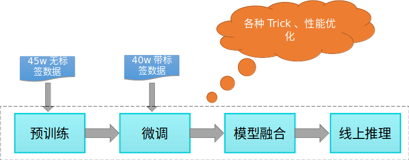

## （1）预训练

#### a.模型选取

赛题所给数据经过了脱敏，相当于一种新的语言，无法直接利用开源的预训练模型进行迁移学习

但是预训练依然很有必要，在有限的数据上，我们需要尽可能充分地利用其中的信息，Bert语言模型的MLM预训练任务可以利用无监督文本信息，学习文本表征、语言学知识和世界性知识

我们选用的是Bert和其变种Nezha，二者主要区别在于绝对位置编码与相对位置编码

考虑到后续的模型融合以及线上环境提供四卡，我们预训练了四个模型，参数量皆为1亿左右

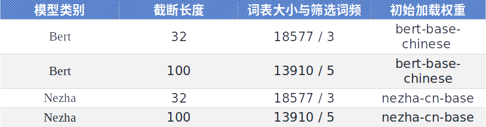

#### b.MASK策略

模型输入为经典的拼接形式：[CLS] s1 [SEP] s2 [SEP] 

对偶：s1、s2以50%的概率交换位置，是对语义无损的数据增强方式

长度自适应动态N-gram Mask策略
- 动态Mask：预训练达到400 epoch，上百万次iter，可以每次迭代都随机生成新的mask文本，增强模型泛化能力
- N-gram Mask：以15%的概率选中token，为增加训练难度，选中部分以70%、20%、10%的概率进行1-gram、2-gram、3-gram片段的mask（选中token使用[MASK]、随机词、自身替换的概率和原版Bert一致）
- 长度自适应：考虑到对短文本进行过较长gram的mask对语义有较大破坏，长度小于7的文本不进行3-gram mask，小于4的文本不进行2-gram mask
- 防止小概率的连续Mask：已经mask了的文本片段，强制跳过下一个token的mask，防止一长串连续的mask

#### c.其他Trick与参数设置

- 学习率warmup与衰减

  - 预训练400 epoch ，前4.5个epoch，学习率从0线性增长到5e-5，之后线性衰减到1e-5

- 分块shuffle

  - 预训练周期长，优化时间性能非常重要，分块shuffle将长度差不多的样本组成batch快，块间shuffle，减少padding部分运算量，耗时减少了约40%，实测不会降低模型效果

- 权重衰减

  - 限制网络权值的大小，缓解过拟合现象

- 四个模型通用参数设置

  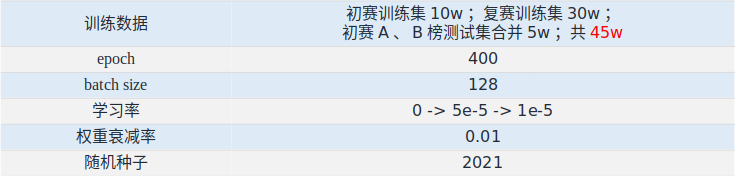

## （2）微调

#### a.模型参数

- 预训练利用文本中的无监督信息，微调则需利用有监督的句子对匹配信息，将赛题任务建模为匹配与不匹配的二分类问题

- 我们在4个预训练模型的基础上，训练了6个微调模型，从词表、截断长度和模型结构等维度保证模型之间的差异性，以便后序模型融合，参数设置对比如下：

  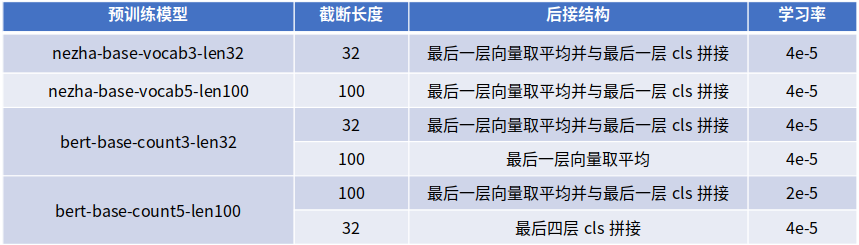

#### b.后接结构

- Bert/Nezha后接的三种结构

  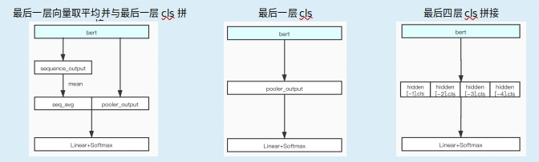

考虑到Bert已经具备强大的特征提取能力，以及运行和推理时限严格，所以其只后接了一些简单的结构。

#### c.Trick

- 学习率

    - warmup与衰减：可以使得训练初期学习率较小，模型可以慢慢趋于稳定，待相对稳定后再以预先设置的学习率进行训练，使得模型收敛速度变得更快。后采用学习率衰减的方式使模型收敛到更佳的极值点，提升最终效果
    - 不同模型采用不同的学习率（2e-5或4e-5）

- 模型融合时先对logits加权平均，后softmax

  - 使得softmax不再是每个模型独立进行，而是综合利用所有模型信息

- 对抗训练

  - 对抗训练是一种引入噪声的训练方式，可以对参数进行正则化，提升模型鲁棒性和泛化能力
    Fast Gradient Method (FGM)：对embedding层在梯度方向添加扰动
    Projected Gradient Descent (PGD) ：迭代扰动，每次扰动被投影到规定范围内
    团队实验了FGM、PGD，前者速度快且效果更佳。

  #### d.通用参数

  最佳参数
  - batch_size=32，预训练充分的情况下，微调收敛非常快，小bs带来更大的随机性，更不容易过早陷入局部最优
  - epoch=3
  - dropout=0.2，训练时以一定概率丢弃某些神经元，缓解过拟合
  - FGM，epsilon=0.25时效果最佳

## （3）模型融合与推理

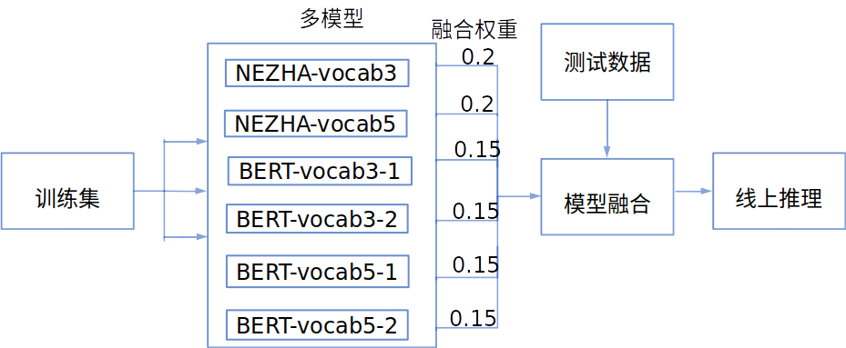

## （4）性能优化

#### a.分块shuffle

- 赛题限制线上总运行时间为80小时，限制推理5w测试集时间为15分钟（含网络开销），性能优化尤为关键

  - 分块shuffle将长度差不多的样本组成batch快，块间shuffle，减少padding部分运算量，预训练耗时减少了约40%

  - 最终预训练线上能控制在9分多钟一个epoch，400个epoch能控制在65小时以内完成

    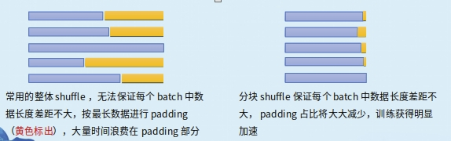

#### b.推理加速

- ONNX Runtime：ONNX Runtime是机器学习模型的预测引擎，能使用内置的图优化（Graph  Optimization）和各种硬件加速功能，来优化和加速推理。像BERT这样的Transformer模型，由许多运算符（Operator）的图构成，ONNX  Runtime内置图优化功能，可以简化图并且减少节点，进而执行更复杂的节点融合和布局优化。通过使用ONNX Runtime，推理部分获得了非常可观的加速。

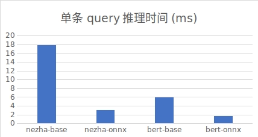

#### c.对cuda版本的调优

- 在大家使用较多的cuda11镜像中，我们发现线上V100速度较慢，根据以往项目经验，老一些的卡用较新的cuda版本未必能发挥出最好的性能，我们尝试更换镜像版本为cuda10.2，cudnn版本配套改为7，onnxruntime-gpu版本配套改为1.5.1，推理速度有了较大提升，使得在15分钟内我们能跑6个模型（以往为4个）

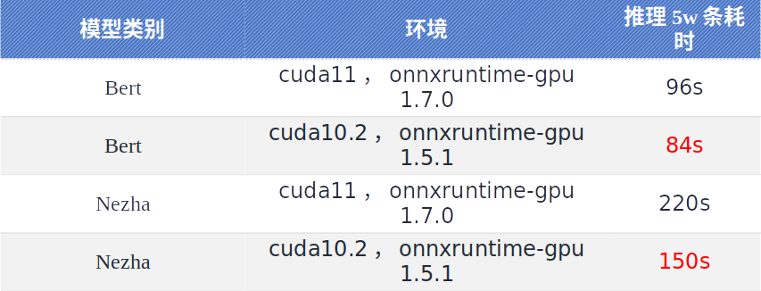

#### d.其他细节

- 减少内存到显存的通信开销：避免使用.to('cuda')的方式将tensor从内存移至显存，增加通信开销，而是一开始就用torch.tensor(xxx,device='cuda')的方式将tensor创建在显存

- 编写更快的分词函数：所给数据已经用空格将token隔开，避免使用tokenize函数将数据整体当做字符串进行分词，而是按空格split后直接convert_tokens_to_ids

- ……

# 5.创新和落地

#### a.创新

- 融入对偶的长度自适应动态N-gram Mask策略

- 不同词表、不同截断长度、不同结构的模型融合，保证模型差异性

- 学习率warmup与衰减、模型权重衰减、对抗训练等Trick

- 性能优化，包括分块shuffle、ONNX Runtime的使用、对cuda版本的调优和其他细节优化

#### b.落地

- 我们的模型将语义匹配转换为分类问题，这是一种通用性非常强的解决方案，可以广泛落地于自然语言处理领域中涉及到句子关系的各项任务中，如开放域意图识别（本赛题）、QQ匹配、QA匹配、文本蕴含等

- 推理速度较快，不计网络通信消耗，比赛使用的6模（4 Bert，2 Nezha）融合后可达77的QPS（AUC 0.9579），在牺牲不到一个百分点的AUC下，单模Bert可达595的QPS（AUC 0.948）

- 实际生产环境复杂，短文本相对容易出现语义缺失，且受噪声影响相对更大（用户输错或语音识别错误几个字，占短文本整体的比例可能就较大），可能需考虑辅以指代消解、文本补全、文本纠错等技术

- 深度学习并非万能，实际落地时，需要不断进行badcase分析，适当辅以规则的方法提升系统鲁棒性

# 6.方案总结

- 总结性回答
  - 我们从预训练、微调、模型融合和推理四个方面入手，每个阶段进行针对性的策略改进及创新，辅以性能优化，最终形成了一个较好的端到端解决方案，可以广泛落地于自然语言处理领域中涉及到句子关系的各项任务中，具有较好的实用性和创新性。
- 方法优劣势分析、展望
  - 优点：效果好，速度快，模型通用性强
  - 缺点：交互型模型因为每次计算都需要输入完整句子对，不适合于从海量文本中召回结果，而是适合在召回小部分候选集后，进行精细的排序
  - 展望：从科学研究角度，我们要利用好预训练模型这个核武器，设计更有针对性，更加合理的预训练任务，此外也可探索结合上下文、引入知识的多轮匹配任务。从应用角度，可以从badcase出发，不断优化算法，挖掘用户需求，让小布成为一个知识更加渊博，对话更加流畅，更加人性化的智能助理


# 7.前排大佬解决方案

# 一、AI小花

https://github.com/nilboy/gaic_track3_pair_sim

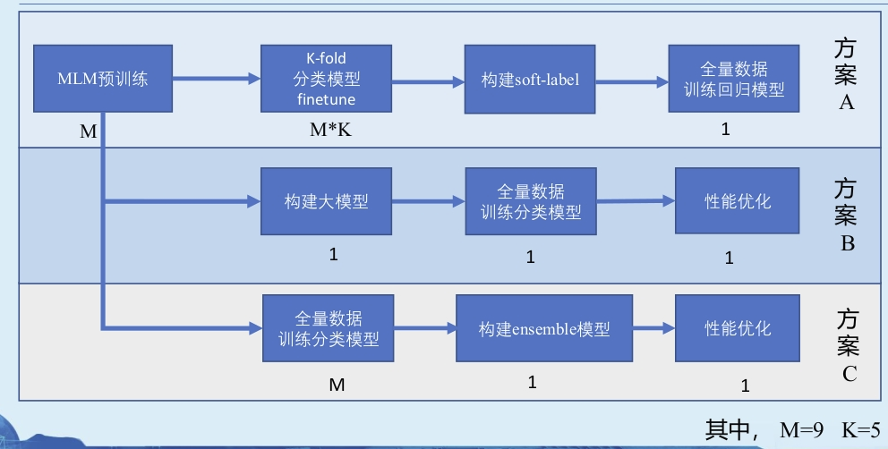

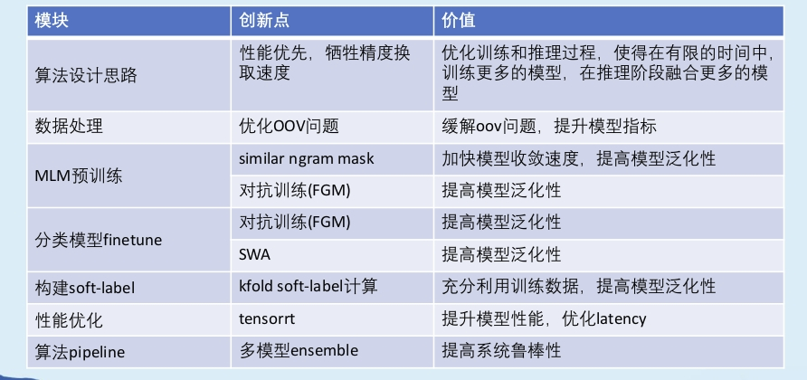

# 二、[none]

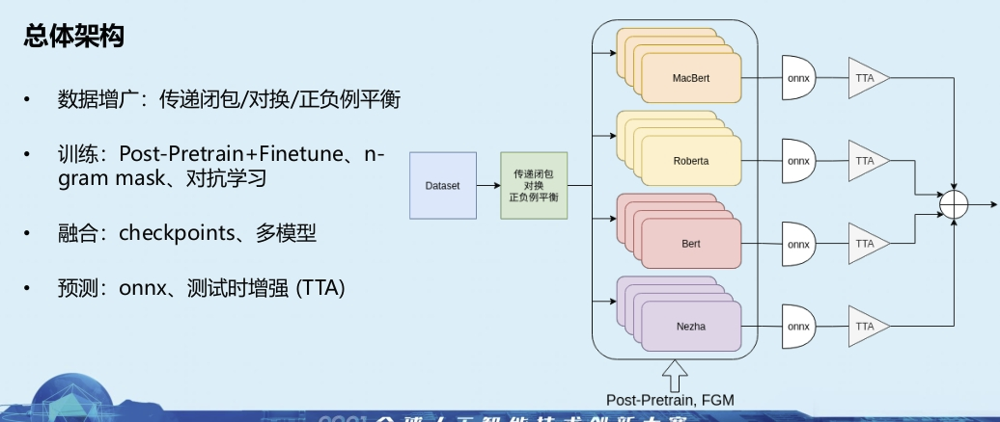

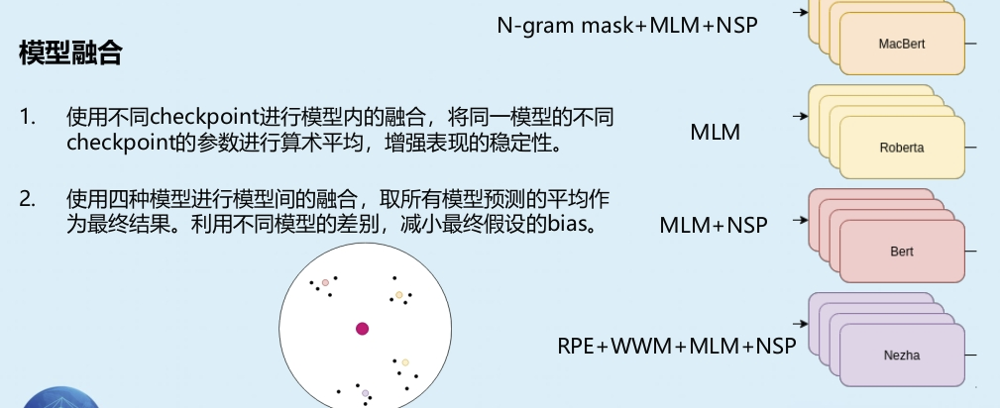 

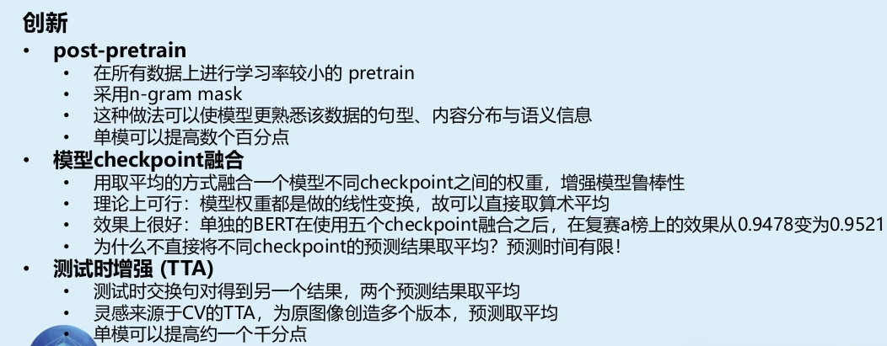

# 三、赛道3-白[MASK]

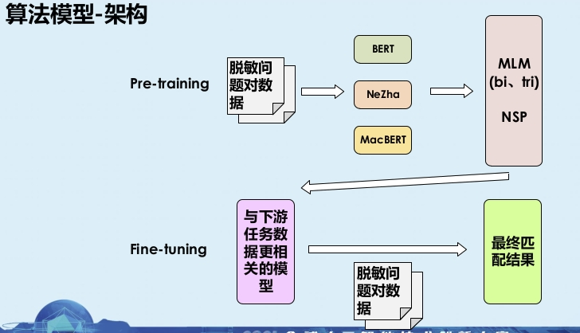

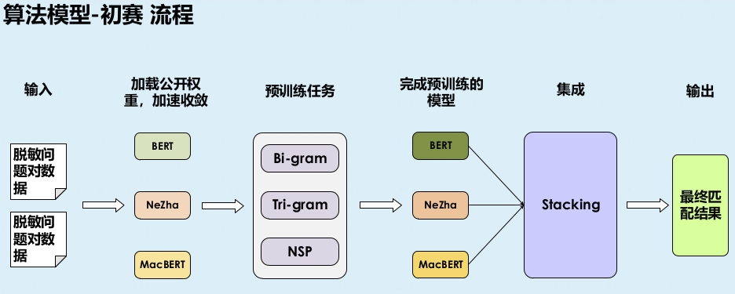

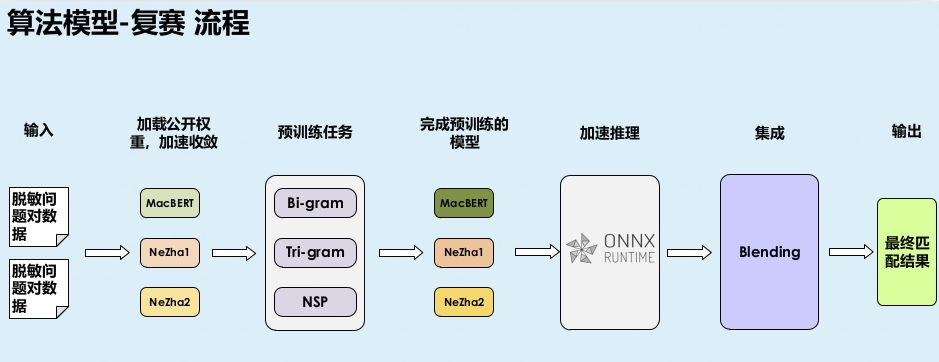

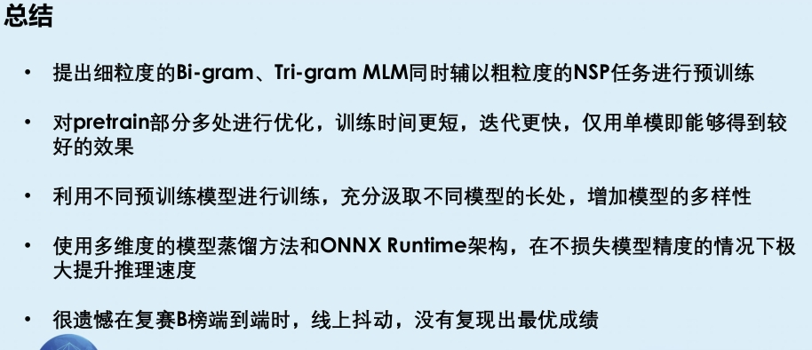

# 四、科讯嘉联灵珠团队

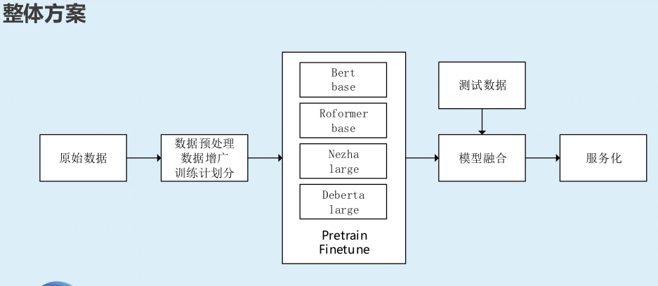

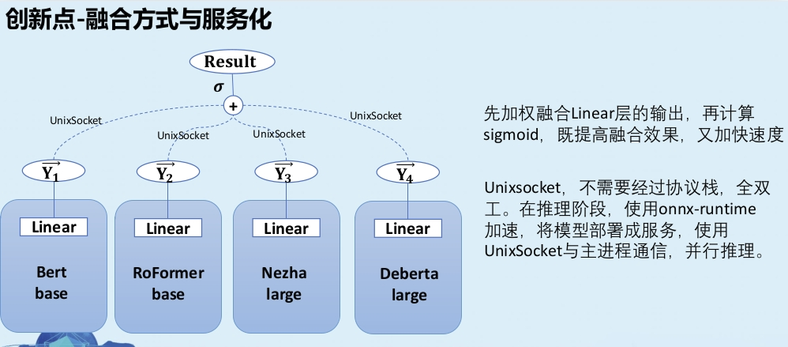

# 五、LOL王者

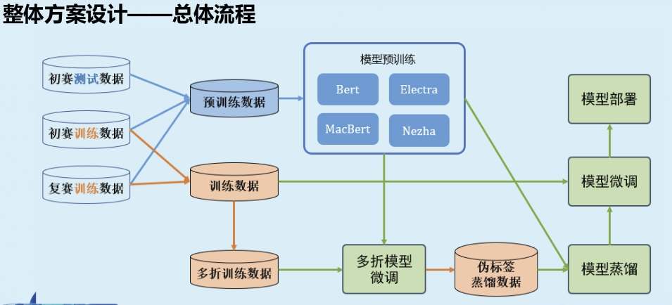

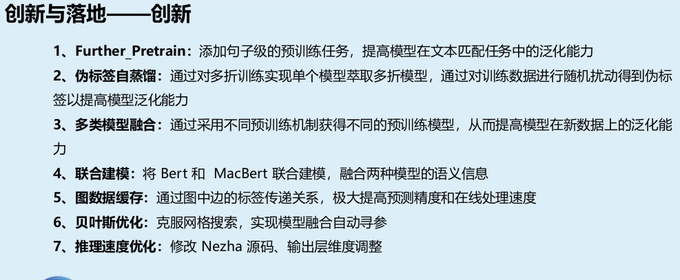

